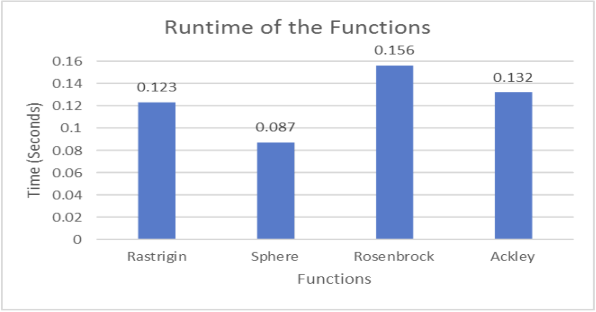

# Particle Swarm Optimization (PSO) for the Prisoner's Dilemma

Authors: [Enricco Gemha](https://github.com/G3mha), [Joseph Vazhaeparampill](https://github.com/Josephvazhae1)

## Background of Algorithm
Particle Swarm Optimization is a metaheuristic, population-based optimization algorithm that is also classified as a swarm intelligence technique. It was originally developed by James Kennedy and Russel Eberhart to simulate social behaviour of a flock of birds looking for food. However, they soon realized its applicability to optimization problems and would later refine it with Yuhui Shi to create a technique for solving optimization problems. 
Because it does not rely on gradient descent, it can be applied to a wide variety of problems, including those that have non-differentiable or non-continuous reward functions. It also has faster convergence compared to most genetic algorithms since it leverages direct communicaiton between the particles instead of evolutionary selection and is relatively simple computationally only requiring position and velocity updates. Unlike simulated annealing, which follows only a single solution path, particle swarm optimization makes use of collective learning with data from each of its particles. For these reasons, it has since been widely adopted in a large variety of spaces including engineering, artificial intelligence and finance.
However, particle swarm does come with its fair share of shortcomings. The swarm can often converge to local optimums rather than absolute ones due to its heuristic nature, particular if the parameters are not effectively tuned. For instance, a larger swarm size(N) provides a better global search but also increases the computational cost. Inertia weight(w) controls how much a particle retains its previous velocity, which is useful early in the search to promote exploration, but not nearly as helpful later in the search when trying to refine the solution. Then there are the cognitive and social learning factors, c_1 and c_2. The cognitive factor c_1 encourages individual exploration, while the c_2 factor encourages group convergence. Stopping criteria could also have a large impact on the effectiveness of the algorithm. If there are not enough timesteps, the particle swarm might not find the global optimum, but a local one. Additionally, in solution spaces with higher dimensionality, finidng the optimum solution becomes more and more computationally expensive and time-intensive.

## Walkthrough
1) Initialize the Swarm:
   - Define the number of particles 𝑁
   - Randomly initialize each particle’s position 𝑥_𝑖, y_𝑖, z_𝑖 . . . (depending on the dimensionality of the solution space).
   - Randomly initialize each particle’s velocity 𝑣_𝑖
 2) Set parameters such as inertia weight 𝑤, cognitive coefficient 𝑐_1, and social coefficient 𝑐_2.
 3) Evaluate the Fitness for each particle based on the objective function:
 4) Identify the best position each particle has achieved so far
 5) Identify the best position any partivle has achieved so far
 6) Update Velocity and Position:<br/>
    $$𝑣_{𝑖+1} = 𝑤𝑣_𝑖 + 𝑐_1𝑟_1(𝑝_𝑖−𝑥_𝑖)+𝑐_2𝑟_2(𝑔−𝑥_𝑖)$$ <br/>
    $$𝑥_{𝑖+1} = 𝑥_𝑖 + 𝑥_𝑖𝑣_𝑖 + 𝑐_1𝑟_1(𝑝_𝑖−𝑥_𝑖)+𝑐_2𝑟_2(𝑔−𝑥_𝑖)$$
    - w is the inertia weight
    - c_1 & c_2 are acceleration coefficients
    - r_1 & r_2 are random numbers between 0 & 1
    - p_i is the personal best position
    - g is the global best position 
  7) Apply constraints to make sure the particle stays within the solution space
  8) Repeat steps 2–5 until a stopping criterion is met:
     - Maximum number of iterations reached.
     - Improvement in the global best fitness is below a threshold.
  9) Return g as the best approximation to the optimal solution.

Here is a visualization of the progression of particle swarm optimization on a Rastrigin function, a non-convex function with many local maxima often used as a performance test for optimization algorithms. Here is a visualization of the Rastrigin function.
<br/>
For x ∈ [−5.12, 5.12] and y ∈ [−5.12, 5.12], Rastrigin has a global maxima around x = 4.52299366 and y = 4.52299366.
Our particle swarm implementation over 100 timesteps found the global maxima to be x = 4.19189874 and y = 4.31836399.
Here is a visualization of that implementation: https://github.com/user-attachments/assets/f5412532-3587-4027-9cc9-fcfa86d1f1e6


### Choosing the Fitness Function

In the (3) paper, we can see a comparison of the runtime of the PSO algorithm using different fitness functions. The functions compared were:


_Extracted from the paper (3)_

Therefore, for its better runtime, we chose the Sphere as the fitness function for our PSO algorithm. For a multi-dimensional problem with n parameters, the Sphere function is defined as:

$$f(\vec{x}) = \sqrt{\sum_{i=1}^{n} w_i(x_i - c_i)^2}$$

Where:
  
- $\vec{x} = (x_1, x_2, ..., x_n)$ is the vector of normalized parameters
- $\vec{c} = (c_1, c_2, ..., c_n)$ is the center point (ideal solution)
- $\vec{w} = (w_1, w_2, ..., w_n)$ is the vector of weights for each dimension

In Python, the function can be implemented as:

```python
def sphere_fitness_function(x, center, weights):
  """
  Generalized Sphere fitness function for n dimensions.
  """
  return np.sqrt(sum(weights[i] * (x[i] - center[i])**2 for i in range(len(x))))
```

## Solving a Problem

### How Data Was Collected

All the data was collected through the GitHub API. The data was collected in two steps. The first step was to collect the top 20 repositories on GitHub for contributors, chosen by their number of stars received. The second step was to collect the data for each of the top 20 repositories.

The data was collected in a CSV file, which can be found in the data folder. The attributes collected for each repository can be found in [Contribution Metrics](#contribution-metrics) and [Activity Metrics](#activity-metrics).

### Contribution Metrics

- **unique_contributors_count**: The total number of different individuals who have contributed to the repository.

- **median_contributions_per_contributor**: The median value in the distribution of contributions, indicating the typical contribution level.

- **mean_contributions_per_contributor**: The average number of contributions per contributor.

- **contribution_gini_coefficient**: A measure of inequality in contributions, where:
  - 0: Perfect equality (everyone contributes equally)
  - 1: Perfect inequality (one person makes all contributions)
  - Values around 0.8 suggest a heavy concentration of work among a small core group

### Activity Metrics

- **total_annual_commits**: The total number of commits made to the repository over the past year.

- **average_weekly_commits**: The mean number of commits per week, indicating the typical activity level.

- **commit_consistency**: A measure of how evenly distributed commits are over time. Lower values indicate more consistent contribution patterns, while higher values suggest more sporadic development with bursts of activity.

### Normalizing Data and Scaling

The data was normalized using the Min-Max scaling method, which scales all the 7 metrics to a fixed range of 0 to 1. The arbitrary range was chosen to make the data comparable and easier to work with in the PSO algorithm.

```python
min_values = [
  1,      # unique_contributors_count: Min 1 contributor
  1,      # median_contributions_per_contributor: Min 1 contribution 
  1,      # mean_contributions_per_contributor: Min 1 contribution
  0,      # contribution_gini_coefficient: 0 = perfect equality
  1,      # total_annual_commits: Min 1 commit per year
  0.02,   # average_weekly_commits: ~1 commit per year
  0,      # commit_consistency: 0 = perfectly consistent
]

max_values = [
  5000,   # unique_contributors_count: Accommodate larger projects
  500,    # median_contributions_per_contributor: Higher ceiling
  1000,   # mean_contributions_per_contributor: Higher ceiling for skewed distributions
  1,      # contribution_gini_coefficient: 1 = perfect inequality
  50000,  # total_annual_commits: ~1000 commits per week
  1000,   # average_weekly_commits: Higher ceiling
  10,     # commit_consistency: Higher ceiling for more variable projects
]
```

It was also necessary to define a ideal center point and weights for the Sphere fitness function. Those values were arbitrarily defined based on the already normalized data:

```python
ideal_center = [
  0.75,  # unique_contributors_count: High but not maximum (broad participation)
  0.65,  # median_contributions_per_contributor: Moderately high (sustained engagement)
  0.55,  # mean_contributions_per_contributor: Moderate (balanced contributions)
  0.25,  # contribution_gini_coefficient: Low (equal distribution of work)
  0.65,  # total_annual_commits: Moderately high (active development)
  0.55,  # average_weekly_commits: Moderate (consistent activity)
  0.35   # commit_consistency: Low to moderate (regular rather than sporadic)
]

weights = [
  1.5,  # unique_contributors_count: Higher weight (broad participation)
  1.0,  # median_contributions_per_contributor: Standard weight
  1.0,  # mean_contributions_per_contributor: Standard weight
  2.0,  # contribution_gini_coefficient: Highest weight (equality of contributions)
  1.0,  # total_annual_commits: Standard weight
  1.0,  # average_weekly_commits: Standard weight
  1.3   # commit_consistency: Higher weight (consistency of cooperation)
]
```

It is important to note that the weights were arbitrarily defined and could be adjusted based on the specific context of the problem, and are a potential improvement to be made in a future iteration, as discussed in the [Ethical Analysis](#ethical-analysis).

## Ethical Analysis

### How Particle Swarm Optimization Might Be Misused

The algorithm could be misused in several ways, such as:

- **Manipulate contributor behavior**: Organizations could optimize engagement metrics while minimizing actual resource allocation, creating a facade of community while extracting maximum value from contributors.

- **Corporate competitive advantage**: Large companies could strategically identify optimal non-contribution strategies that appear cooperative but actually minimize their resource commitment to open-source projects they profit from.

### Algorithmic Bias

Although unbiased in its core design, particle swarm optimization can introduce bias through the fitness function used to evaluate contributions. Those potential sources of bias include:

- **Concentration bias**: With a high contribution Gini coefficient, there's significant inequality in participation. If the algorithm optimizes strategies for this concentration, it would favor a small group of contributors, while the median contributor has far fewer contributions.

- **Activity rhythm bias**: Based on the commit consistency metrics, the algorithm might favor contributors who match existing project rhythms, potentially neglecting important contributions from those with a non-traditional work schedule.

- **Scale bias**: In a repository with hundreds of unique contributors but a small number of weekly commits, the algorithm can undervalue small but critical contributions from the majority of participants who contribute below the mean rate.

- **Fitness function bias**: The fitness function used to evaluate the contribution parameters can introduce bias if the weights between each features are not properly balanced, or key features are not accounted for. For example, the function can only considers code commits, neglecting other essential contributions like documentation or community support. Another example is the function being too heavily weighted towards the number of commits, incentivizing quantity-over-quality contributions.

### Mitigation Strategies

These ethical concerns can be addressed through:

- **Transparent fitness functions**: Clearly document how the scores for contribution are calculated, allowing judged communities to audit and refine the metrics, as any other Open-Source project.

- **Optimization goals**: Incorporate in the future a multi-objective optimization, valuing different types of contributions (code, documentation, community support), and not just commits.

- **Regular algorithmic audits**: Periodically check if the algorithmic outcomes are fitting with the reality of the project, and its potential unusual workflow.

### Case Studies

1. **Linux Kernel Development**: The Linux Foundation's 2024 report showed that over 4,300 developers from 500 companies contributed to the kernel, with unpaid developers contributing to only 8.2% of the development. This is situation where the algorithm can concentrate development influence on corporate players, that if not carefully balanced, can hinder individual contributions.

2. **OpenSSL Heartbleed Vulnerability**: Despite securing 66% of web servers, OpenSSL was maintained by two part-time employees prior to the critical Heartbleed bug in 2014. Annual donations pre-2014 never exceeded $1 million, and with minimal code contributions. It was only after the incident that the Linux Foundation’s Core Infrastructure Initiative, addressed the systemic underfunding. It is a clear example of how algorithms focused solely on feature contributions, without contextual maintenance work or financing informating, can lead to catastrophes affecting billions of users.

## Sources

1. [Linux Foundation Report 2024 Analysis](https://datacentre.solutions/news/52774/the-linux-foundation-releases-annual-kernel-development-report)

2. [OpenSSL Heartbleed Vulnerability](https://www.mend.io/blog/how-the-heartbleed-vulnerability-shaped-openssl/)

3. [Optimizing Benchmark Functions using Particle Swarm Optimization PSO](https://journal.alsalam.edu.iq/index.php/ajest/article/view/494/175)

4. [Particle Swarm Optimization] (https://www.sciencedirect.com/topics/physics-and-astronomy/particle-swarm-optimization#:~:text=Particle%20swarm%20optimization%20(PSO)%20was,bird%20flock%20or%20fish%20school.)
   
5. [Particle Swarm Optimisation: A Historical Review Up to the Current Developments] (https://pmc.ncbi.nlm.nih.gov/articles/PMC7516836/)
